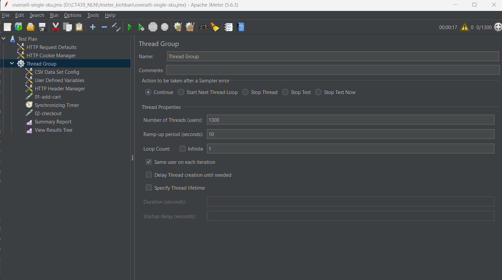
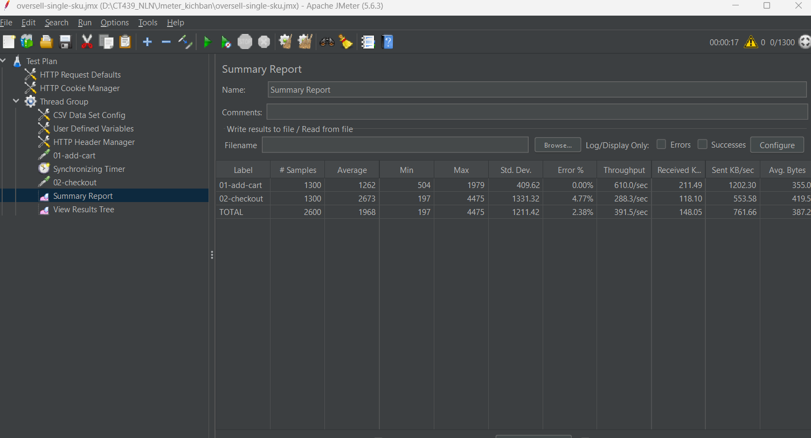
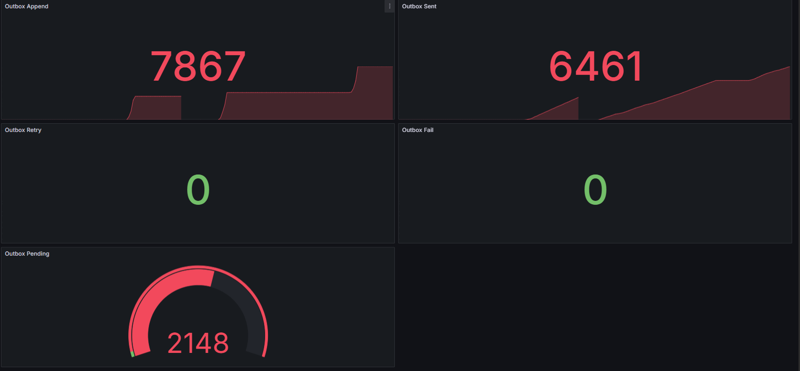
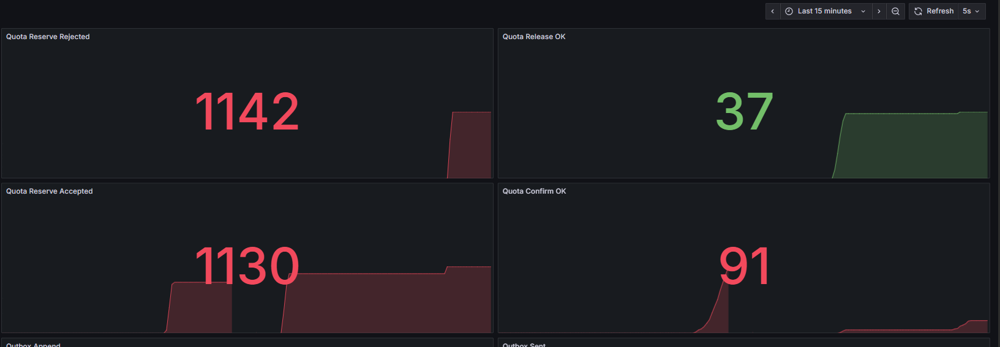
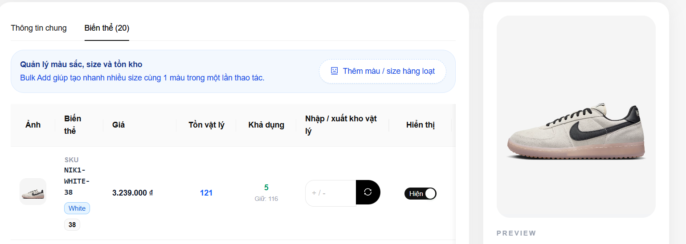
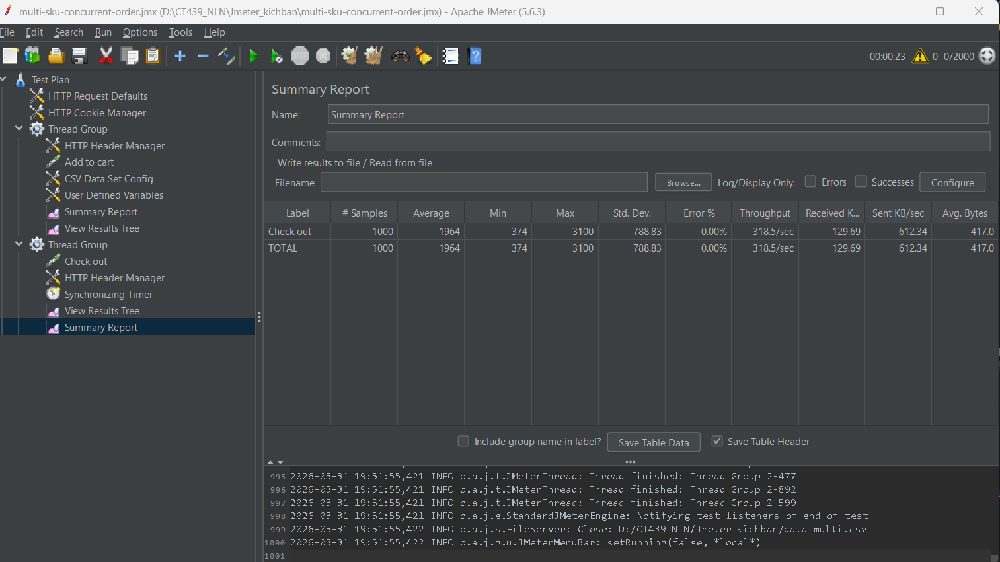
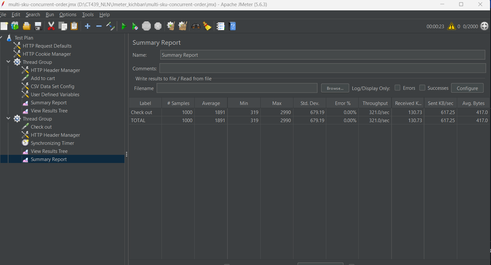

# Ecommerce Backend + LSF Integration

Backend này không được dùng để xây một hệ ecommerce đầy đủ tính năng, mà là **consumer project** để kiểm chứng framework **LSF** trong một hệ microservices thực tế. Trọng tâm của repo là cho thấy khi áp LSF vào flow đặt hàng, hệ thống đã thay đổi như thế nào ở các phần: **reservation lifecycle**, **reliable event publishing**, **observability** và **admin/ops support**.

## Lưu ý quan trọng trước khi chạy

Repo này là **consumer project** đã tích hợp một phần framework **LSF**.  
Vì vậy, nếu clone riêng repo này thì **chưa đủ để build ngay**, do một số dependency `com.myorg.lsf:*` đang dùng version `1.0-SNAPSHOT`.

Để chạy local đúng cách, cần:

1. clone repo framework `LSF-Microservices-Support-Framework`
2. build và install framework vào local Maven repository
3. sau đó mới build/chạy repo `Backend-consumer`

Nói ngắn gọn: repo này dùng để chứng minh **framework đã được áp dụng vào hệ ecommerce**, không phải một repo hoàn toàn độc lập với framework.

## LSF đã được áp vào đâu

| Service | Module LSF đã dùng | Vai trò trong hệ thống |
|---|---|---|
| `inventory-service` | `lsf-quota-streams-starter`, `lsf-contracts`, `lsf-kafka-starter`, `lsf-observability-starter` | Chuyển logic giữ hàng từ trừ stock trực tiếp sang `reserve / confirm / release`, expose thêm availability |
| `order-service` | `lsf-kafka-starter`, `lsf-contracts`, `lsf-outbox-mysql-starter`, `lsf-outbox-admin-starter`, `lsf-observability-starter` | Điều phối order flow, ghi status event vào outbox, mở admin endpoint cho outbox |
| `payment-service` | `lsf-kafka-starter`, `lsf-observability-starter` | Chuẩn hóa Kafka integration, giữ vai trò phát kết quả payment để kích hoạt confirm hoặc release |
| `notification-service` | `lsf-eventing-starter` | Nhận status event dạng envelope để đẩy cập nhật realtime |

## Hệ thống đã thay đổi như thế nào sau khi áp LSF

| Trước khi tích hợp | Sau khi tích hợp |
|---|---|
| Kafka config chủ yếu viết thủ công theo từng service | Dùng starter để chuẩn hóa phần Kafka dùng chung |
| Inventory check pass thì trừ stock sớm | Đổi sang quota reservation: `reserve -> confirm / release` |
| Payment fail hoàn tác bằng kiểu cộng stock lại | Payment fail sẽ phát `ReleaseReservationCommand` để release reservation |
| Update DB xong gửi Kafka trực tiếp | Status event được append vào `lsf_outbox`, publisher nền gửi ra Kafka |
| Dùng raw status event trên topic cũ | Chuyển sang `EventEnvelope` và topic riêng `order-status-envelope-topic` |
| UI/admin dễ nhầm giữa tồn vật lý và tồn có thể bán | Tách rõ **physical stock** và **available stock** qua API availability |

## Tài liệu đối chiếu tích hợp

Để xem rõ framework đã được áp vào đâu trong consumer project, có thể đọc thêm:

- [`docs/LSF_INTEGRATION_BEFORE_AFTER.md`](docs/LSF_INTEGRATION_BEFORE_AFTER.md)
- [`docs/LSF_INTEGRATION_TRACEABILITY.md`](docs/LSF_INTEGRATION_TRACEABILITY.md)

Hai tài liệu này mô tả:
- trước và sau khi tích hợp framework hệ thống thay đổi ra sao
- module nào của LSF được dùng ở service nào
- file/class/method nào là điểm tích hợp chính
- phần nào thuộc framework, phần nào vẫn là business logic của consumer project

## Những phần tích hợp nổi bật

### 1. Quota-based reservation trong `inventory-service`
- Áp `lsf-quota-streams-starter` qua `InventoryQuotaService`
- Map từ dữ liệu nghiệp vụ của ecommerce sang `quotaKey` và `requestId`
- Thay flow giữ hàng từ kiểu trừ stock trực tiếp sang:
  - `reserve`
  - `confirm`
  - `release`
- Có thêm endpoint availability để tách bạch tồn vật lý và tồn khả dụng

### 2. Outbox trong `order-service`
- Áp `lsf-outbox-mysql-starter`
- Thêm bảng `lsf_outbox`
- Khi order đổi trạng thái, service không publish trực tiếp nữa mà ghi `EventEnvelope` vào outbox
- Publisher nền sẽ gửi event ra Kafka sau đó

### 3. Outbox admin và observability
- Áp `lsf-outbox-admin-starter` để mở các endpoint quản trị outbox tại `/admin/outbox`
- Bật Actuator / Prometheus metrics cho các service chính
- Có dashboard để theo dõi quota và outbox flow khi demo hoặc benchmark

### 4. Contract evolution
- Không reuse `order-status-topic` cũ cho outbox
- Tách topic mới `order-status-envelope-topic`
- `OrderStatusJoiner` và notification flow đọc `EventEnvelope` rồi unwrap payload để xử lý tiếp

## API / bằng chứng kỹ thuật đáng chú ý

- `GET /api/inventory/{sku}`: physical stock
- `GET /api/inventory/{sku}/availability`: available stock sau khi trừ quota used
- `/admin/outbox/**`: xem row outbox, filter trạng thái, retry/requeue
- `/actuator/prometheus`: metrics cho quota, outbox và service health

## Ý nghĩa của repo này

Repo này chủ yếu chứng minh LSF đã được áp vào một consumer project thật ở 4 lớp:

1. **Kafka integration**
2. **Reservation lifecycle**
3. **Reliable event publishing bằng outbox**
4. **Observability / admin operations**

Nói ngắn gọn, thay đổi quan trọng nhất của hệ thống sau khi áp framework là:

```text
trừ stock trực tiếp -> reserve / confirm / release
```

và:

```text
update DB rồi gửi Kafka trực tiếp -> append to outbox -> publisher gửi nền
```
## Yêu cầu môi trường

- JDK 24 để build repo consumer hiện tại
- Maven 3.9+
- Docker và Docker Compose
- Các port local còn trống: 3306, 6379, 8080, 8081, 8085, 8761, 9090, 9411

> Lưu ý: framework LSF hiện để `maven.compiler.source/target=21`, còn consumer repo đang để `24`.
> Nếu muốn giảm rủi ro cho người clone, nên đồng bộ các repo về cùng một version Java.

## Cách chạy local

### 0. Cài framework LSF vào local Maven

```bash
git clone https://github.com/truongnguyen3006/LSF-Microservices-Support-Framework.git
cd LSF-Microservices-Support-Framework
mvn clean install -DskipTests
```

### 1. Clone project

```bash
git clone  https://github.com/truongnguyen3006/Backend-consumer.git
cd <project-folder>
```

### 2. Chạy hạ tầng

Tại thư mục gốc backend:

```bash
docker compose up -d
```

### 3. Chạy các service Spring Boot

Có thể chạy bằng IDE hoặc Maven. Thứ tự nên chạy:

1. `discovery-server`
2. `api-gateway`
3. `user-service`
4. `product-service`
5. `inventory-service`
6. `order-service`
7. `payment-service`
8. `cart-service`
9. `notification-service`

Ví dụ:

```bash
cd order-service
mvn spring-boot:run
```

## Nếu gặp lỗi khi chạy lại từ đầu

Vì repo dùng MySQL init script, Flyway migration và dữ liệu local để demo integration, đôi khi môi trường cũ có thể làm phát sinh lỗi như:

- bảng đã tồn tại
- Flyway schema history không khớp
- dữ liệu cũ làm sai lệch kết quả benchmark

Khi đó nên reset lại volume/container database rồi chạy lại từ đầu:

```bash
docker compose down -v
docker compose up -d
```
## Kiểm thử tải với JMeter

Repo cung cấp 2 kịch bản trong thư mục [Jmeter Script](./Jmeter%20Script/) để kiểm thử luồng đặt hàng đồng thời:

- `oversell-single-sku.jmx`: nhiều request cùng đặt mua một SKU để kiểm tra khả năng chặn oversell
- `multi-sku-concurrent-order.jmx`: nhiều request đồng thời đặt mua nhiều SKU khác nhau để kiểm tra tải phân tán trên nhiều biến thể sản phẩm

Các file dữ liệu đi kèm:

- `data_oversell.csv`: chứa một `skuCode` dùng chung cho toàn bộ request
- `data_multi.csv`: chứa danh sách nhiều `skuCode` để phân tán tải trên nhiều sản phẩm

### Chuẩn bị trước khi chạy

Trước khi chạy kịch bản, cần bảo đảm:

- backend API đang chạy và truy cập được
- các service liên quan đến luồng đặt hàng đã sẵn sàng
- dữ liệu test hợp lệ, gồm user, SKU, tồn kho và trạng thái dịch vụ
- đã có access token hợp lệ cho các request cần xác thực

### Cấu hình kịch bản trong JMeter

Mở một trong hai file `.jmx` bằng JMeter, sau đó kiểm tra và cập nhật lại các thành phần sau:

#### 1. Cấu hình địa chỉ API

Trong các `HTTP Request`, cập nhật lại:

- `Server Name or IP`
- `Port Number`

Theo địa chỉ backend đang sử dụng.

Nên dùng thống nhất một địa chỉ trong toàn bộ file test để tránh sai lệch kết quả khi benchmark.

#### 2. Cấu hình file dữ liệu CSV

Trong `CSV Data Set Config`, trỏ đúng tới file dữ liệu tương ứng trong thư mục `Jmeter Script`:

- `data_oversell.csv`
- `data_multi.csv`

Nếu JMeter đang giữ đường dẫn tuyệt đối cũ, cần sửa lại cho đúng vị trí hiện tại của file.

#### 3. Cập nhật access token

Trong `HTTP Header Manager`, thay giá trị:

```text
Authorization: Bearer <access_token>
```

bằng token mới.

Lưu ý: token có thời hạn. Khi hết hạn, cần đăng nhập lại để lấy token mới rồi cập nhật lại trong JMeter.

#### 4. Kiểm tra biến và tham số trong kịch bản

Trước khi chạy, nên kiểm tra lại các biến được sử dụng trong request, đặc biệt là:

- `skuCode` lấy từ file CSV
- các giá trị trong request body
- header xác thực
- các biến dùng để phân biệt từng lần chạy nếu kịch bản có dùng tiền tố như `RUN_PREFIX`

Nếu thay đổi số lượng request đồng thời, cần kiểm tra thêm các thành phần đồng bộ như `Synchronizing Timer` để giá trị khớp với số thread thực tế.

### Cách lấy access token

Hệ thống sử dụng JWT access token cho các request cần xác thực trong JMeter.

#### Tài khoản dùng để test

**1. Keycloak Admin Console**
- Username: `admin`
- Password: `admin`

> Đây là tài khoản dùng để đăng nhập vào **Keycloak Admin Console**, không phải tài khoản người dùng thông thường của ứng dụng.

**2. Tài khoản admin của ứng dụng**
- Username: `admin`
- Password: `admin123`

> Đây là tài khoản admin phía ứng dụng, có thể dùng để đăng nhập qua API, frontend hoặc Postman.

**3. Tài khoản người dùng thông thường**
- Realm import của Keycloak có thể đã bao gồm sẵn một số tài khoản test.
- Có thể tự đăng ký thêm tài khoản mới qua frontend hoặc API nếu cần.

#### Cách 1: Lấy token bằng `curl`

```bash
curl -X POST http://localhost:8000/auth/login \
  -H "Content-Type: application/json" \
  -d '{
    "username": "admin",
    "password": "admin123"
  }'
```

#### Cách 2: Lấy token bằng Postman

Tạo request:

```http
POST http://localhost:8000/auth/login
Content-Type: application/json
```

Body:

```json
{
  "username": "admin",
  "password": "admin123"
}
```

Sau khi đăng nhập thành công, copy giá trị `access_token` từ response và thay vào `HTTP Header Manager` trong file `.jmx`.

### Lưu ý khi benchmark

Để kết quả ổn định hơn, nên gửi request trực tiếp tới địa chỉ chạy backend thay vì đi qua lớp trung gian không cần thiết.

Nếu hệ thống chạy trong WSL2, có thể lấy IP bằng lệnh:

```bash
wsl ip -4 addr show eth0
```

Tránh trộn nhiều kiểu địa chỉ khác nhau trong cùng một file test, ví dụ vừa dùng `localhost` vừa dùng IP khác, vì dễ gây sai lệch khi đo tải.

### Gợi ý kiểm tra nhanh trước khi bấm chạy

Nên rà lại các điểm sau:

- backend trả response bình thường với request đặt hàng
- SKU trong file CSV tồn tại thật trong hệ thống
- tồn kho đủ hoặc đúng theo mục tiêu kiểm thử
- token còn hiệu lực
- toàn bộ `HTTP Request` đang trỏ đúng host và port
- `CSV Data Set Config` đang đọc đúng file dữ liệu

## Kết quả kiểm thử tải sau khi mở rộng lên 2 instance API Gateway

### Kịch bản 1: Oversell trên một SKU

#### JMeter Test Plan


#### JMeter Summary Report


#### Grafana dashboard Oversell Outbox


#### Grafana dashboard Oversell Quota


#### Kết quả tồn kho sau test


### Kịch bản 2: Tải đồng thời trên nhiều SKU

#### JMeter Test Plan


#### JMeter Summary Report


## Hạn chế hiện tại

- Đây vẫn là consumer project để chứng minh framework, không phải một backend ecommerce hoàn chỉnh theo hướng production
- Một số phần domain và orchestration vẫn thuộc về project consumer, framework không thay toàn bộ business flow
- Benchmark tải lớn vẫn phụ thuộc khá nhiều vào môi trường local

## Tác giả

- **Tên:** Nguyễn Lâm Trường
- **Email:** lamtruongnguyen2004@gmail.com
- **GitHub:** [https://github.com/truongnguyen3006](https://github.com/truongnguyen3006)
